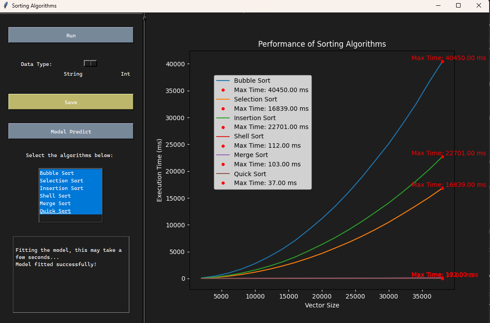

# Sorting Algorithms

This repository contains a project that combines C++ and Python to implement various sorting algorithms, such as Bubble Sort, Selection Sort, Insertion Sort, Shell Sort, Merge Sort, and Quick Sort. The project includes a graphical user interface (GUI) built using Tkinter to visualize the performance of these sorting algorithms in terms of execution time, while also allowing you to choose the data type to be sorted. Additionally, it provides the ability to compile and execute the C++ sorting program, save the generated performance graphs as images, and visualize a Stochastic Gradient Descent (SGD) linear regression model that was custom-developed for more organic and approximate curve visualization.



## Table of Contents
- [Introduction](#introduction)
- [Sorting Algorithms](#sorting-algorithms)
- [Project Structure](#project-structure)
- [Usage](#usage)
- [Documentation](#documentation)
- [License](#license)

## Introduction

Sorting is a fundamental operation in computer science, and this project is designed to help you understand and visualize the performance of different sorting algorithms. You can select the type of data (strings or integers) and see how each algorithm performs in terms of execution time. The GUI allows you to generate graphs, save them, and analyze the data.

## Sorting Algorithms

The project implements the following sorting algorithms, each with its own time complexity characteristics:

1. **Bubble Sort**: A simple algorithm that compares adjacent elements and swaps them if needed. It repeatedly traverses the list, making it slow for large datasets. Time complexity: **O(n²)**.

2. **Selection Sort**: Sorts by finding the minimum element and placing it at the beginning. It's faster than bubble sort in practice but still has a time complexity of **O(n²)**.

3. **Insertion Sort**: Builds the sorted list by inserting each element at its correct position. Efficient for small datasets, but slow for larger ones. Time complexity: **O(n²)**.

4. **Shell Sort**: Improves upon insertion sort by using gaps to insert elements further apart. Time complexity varies based on the gap sequence (generally between **O(n log n)** and **O(n²)**).

5. **Merge Sort**: Divides the list into halves, sorts them recursively, and then combines them. More efficient for larger datasets due to its divide-and-conquer nature. Time complexity: **O(n log n)**.

6. **Quick Sort**: Another divide-and-conquer algorithm that excels for most inputs. It picks a pivot element, partitions the list based on it, and sorts the sub-lists. Generally faster than merge sort due to smaller constants in its time complexity. Average time complexity: **O(n log n)**.

For more details on each algorithm and their implementations, please refer to the respective source code in the [`include`](/include/) directory.

## Project Structure

The project is organized into several directories:

- [`include`](/include/): Contains the definitions of the sorting classes and methods.
- [`output`](/output/): Contains subdirectories for saved images, prediction model data, and sorting algorithm execution time data.
- [`resource`](/resource/): Contains sample data files for sorting (strings and integers).
- [`src`](/src/): Contains the main project files:
    - [`main.cpp`](/src/main.cpp) (C++ sorting program),
    - [`gui.py`](/src/gui.py) (Tkinter GUI), and
    - [`model.py`](/src/model.py) (SGD linear regression model).
- [`test`](/test/): Contains a C++ test file for unit testing the sorting methods.

## Usage

To run the project, follow these steps:

1. **Clone the Repository**:
```bash
git clone https://github.com/samuellimabraz/SortingAlgorithms.git
```
2. **Navigate to the Root Directory**:
```bash
cd .\SortingAlgorithms\
```
3. **Install Dependencies**:
```bash
pip install -r requirements.txt
```
4. **Run the GUI**:
```bash
python .\src\gui.py
```
The GUI allows you to select the curves of the sorting algorithms, the data type, compile and execute the c++ code for this specific data (string or integer), and also visualize the approximation of the curves with a linear regression model.

## Documentation
For detailed explanations of the project components and source code, please refer to the following links:

- [C++ Sorting Algorithms](include/): Contains the C++ implementations of the sorting algorithms.
- [Tkinter GUI](src/gui.py): The graphical user interface for interacting with the project.
- [SGD Linear Regression Model](src/model.py): The custom-developed Stochastic Gradient Descent (SGD) linear regression model for curve visualization.
- [Plot Pictures](output/images): Images of the graphs generated by the original data generated by running with string data
- [Sample Data](resource/): Sample data files for sorting (strings and integers).

## License

This project is open-source and distributed under the MIT License. Feel free to use, modify, and distribute it as needed. If you find this project useful, we appreciate your contributions and feedback.

If you have any questions or encounter issues, please don't hesitate to open an issue or contact us.


